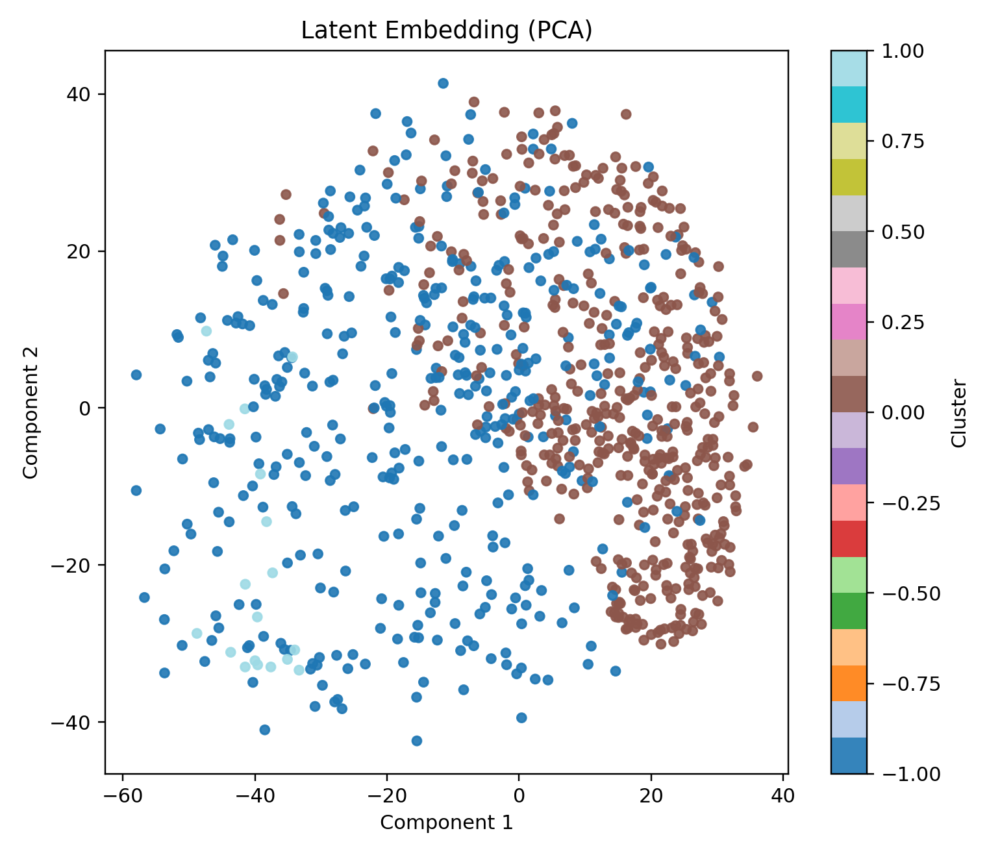

# PLANAR: Planetary Latent Analysis & Representation

PLANAR is a bias-aware, stability-validated unsupervised morphology discovery framework
for protoplanetary disk observations.

It is designed not merely to cluster images, but to test whether discovered
structure reflects physical morphology rather than nuisance factors such as
brightness scaling or orientation.

[](https://github.com/Atharva12081/PLANAR/actions/workflows/ci.yml)


## Key Features

- End-to-end pipeline for image representation learning, latent clustering, and transit classification.
- Config-driven execution with deterministic seeding and structured artifact outputs.
- Scientific diagnostics for brightness/orientation dominance (`eta^2`, Kruskal tests).
- Stability analysis via perturbation-based pairwise ARI.
- Morphology interpretation layer with radial derivative peaks and gap-width proxies.
- PyPI-style package layout (`src/`), CLI entrypoint, tests, and documentation scaffold.

## Scientific Motivation

Protoplanetary disk images contain both physically informative structure (rings, gaps, asymmetries) and nuisance variation (brightness scaling, inclination/orientation). PLANAR is designed to separate these effects by learning latent representations and explicitly auditing cluster bias against nuisance proxies. The goal is clustering that is scientifically meaningful, not merely visually separable.

## Design Philosophy

PLANAR was built under three guiding principles:

1. Determinism before optimization.
2. Scientific validation before visual appeal.
3. Reproducibility before performance claims.

Every clustering result must pass:

- Stability under perturbation
- Bias audit against nuisance proxies
- Transparent metric reporting

## Architecture Overview



```text
FITS Loader -> Preprocessing -> ConvAutoencoder -> Latent Vectors -> Clustering
   |              |                 |                 |                |
   |              |                 |                 |                +-> HDBSCAN / KMeans / GMM
   |              |                 |                 +-> Embedding (PCA/UMAP)
   |              |                 +-> Reconstructions
   |              +-> Radial averaging (optional)
   +-> Validation + shape checks

Transit Simulator -> 1D CNN Transit Classifier -> ROC/AUC + Stress Evaluation
```

## Repository Layout

```text
PLANAR/
├── src/planar/
│   ├── models/
│   ├── pipelines/
│   ├── cli.py
│   ├── config.py
│   ├── data_loader.py
│   ├── preprocessing.py
│   ├── metrics.py
│   ├── science_validation.py
│   └── transit_sim.py
├── configs/
├── scripts/
├── tests/
├── docs/
├── notebooks/
├── reports/
├── pyproject.toml
├── requirements.txt
└── environment.yml
```

## Quickstart

```bash
python -m venv .venv && source .venv/bin/activate
pip install -r requirements.txt && pip install -e .
planar run --config configs/default.yaml
```

## CLI Usage

```bash
# Full pipeline
planar run --config configs/default.yaml

# Autoencoder only
planar train-ae --config configs/default.yaml

# Clustering with explicit checkpoint
planar cluster --config configs/default.yaml --model-path artifacts/autoencoder/autoencoder.pth

# Inference on new FITS folder
planar infer --config configs/default.yaml --data-dir path/to/fits
```

## Sample Output Snippet

```text
2026-03-03 14:10:21 | INFO | planar.pipelines.autoencoder | AE epoch=010 train_loss=0.02189 val_loss=0.01942 train_mse=0.00821 val_mse=0.00750
2026-03-03 14:14:57 | INFO | planar.pipelines.clustering | Clustering complete: method=hdbscan reducer=pca silhouette=0.4172 noise=0.461
2026-03-03 14:16:03 | INFO | planar.pipelines.transit | Transit training complete. test_auc=0.9975 stress_auc=0.9598
2026-03-03 14:16:04 | INFO | planar.pipelines.full | Run report written to reports/PLANAR_REPORT.md
```

## Benchmark Snapshot (Current Artifacts)

Metrics below are from repository artifacts generated with seed-controlled runs:

| Task | Configuration | Result |
|---|---|---|
| Clustering (900 images) | Radial preprocessing + HDBSCAN + PCA | Silhouette `0.4172` |
| Clustering stability | 7 perturbation reruns | ARI mean `0.9841` |
| Bias audit | Brightness `eta^2` / Orientation `eta^2` | `0.0917` / `0.0045` |
| HDBSCAN behavior | Same 900-image run | Noise fraction `0.4611` |
| Transit classifier | Test split AUC | `0.9975` |
| Transit stress test | Red noise + variability + harder settings | AUC `0.9598` |
| Autoencoder | 900-image training run | Best val loss `0.0160` |

Artifact sources: `artifacts/clustering_top_900/`, `artifacts/transit/`, `artifacts/autoencoder_900/`.

## Reproducibility

- Python version is pinned to `3.11.9` in `.python-version`, `pyproject.toml`, and `environment.yml`.
- All stages consume a YAML config (`configs/default.yaml` or `configs/research_top.yaml`).
- Global seed is set once and propagated to NumPy and PyTorch.
- Deterministic cuDNN mode is enabled when PyTorch is available.
- Run outputs are written to versioned artifact folders with JSON summaries for auditability.

## Methodological Notes

- **Why radial averaging:** suppresses azimuthal orientation effects so clustering emphasizes radial morphology (rings/gaps).
- **Why HDBSCAN:** supports variable-density structure and marks ambiguous objects as noise (`-1`) rather than forcing assignment.
- **What silhouette means:** measures within-cluster compactness versus between-cluster separation (higher is better).
- **What ARI stability means:** agreement of cluster partitions under latent perturbations; high ARI indicates robust structure.
- **Why high noise fraction is not always bad:** in density clustering, noise can represent rare/transitional morphologies rather than failure.

## Why This Matters

Astrophysical ML often optimizes predictive performance without testing whether learned structure aligns with physical hypotheses. PLANAR addresses this gap by combining representation learning with explicit scientific validation layers, making unsupervised outcomes more useful for downstream disk-physics interpretation.

## Limitations

- Current transit data are simulated; domain shift to real survey light curves still requires calibration.
- Ring/gap estimators are proxy-based and do not replace radiative transfer modeling.
- HDBSCAN sensitivity to feature scaling and sample density can alter cluster counts.
- Current latent model uses a single autoencoder family; contrastive/self-supervised alternatives are not yet integrated.

## Future Work

- Integrate contrastive pretraining and encoder ensembles.
- Add uncertainty-aware clustering and calibrated outlier scoring.
- Incorporate physically grounded simulators and real mission light curves in transit training.
- Add benchmark datasets and continuous integration for regression tracking.
- Expand docs with API references and experiment registry templates.

## Development and Tests

```bash
pytest -q
```

## License

This project is licensed under the MIT License. See `LICENSE`.

## Citation

If you use PLANAR in research, please cite:

```bibtex
@software{planar2026,
  title        = {PLANAR: Planetary Latent Analysis \& Representation},
  author       = {Atharva Parande},
  year         = {2026},
  url          = {https://github.com/your-username/PLANAR},
  version      = {0.1.0},
  license      = {MIT}
}
```
